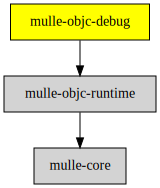

# mulle-objc-debug

#### 🐞 Debug support for the mulle-objc-runtime

Dump runtime classes as HTML or Graphviz dot files. There is also CSV
export functionality. This library is used by MulleObjC to provide debugger
and debugging support.


| Release Version                                       | Release Notes  | AI Documentation
|-------------------------------------------------------|----------------|---------------
|  [](//github.com/mulle-objc/mulle-objc-debug/actions) | [RELEASENOTES](RELEASENOTES.md) | [DeepWiki for mulle-objc-debug](https://deepwiki.com/mulle-objc/mulle-objc-debug)


### You are here




## Requirements

|   Requirement         | Release Version  | Description
|-----------------------|------------------|---------------
| [mulle-objc-runtime](https://github.com/mulle-objc/mulle-objc-runtime) |  [](https://github.com/mulle-objc/mulle-objc-runtime/actions/workflows/mulle-sde-ci.yml) | ⏩ A fast, portable Objective-C runtime written 100% in C11


## Add

Use [mulle-sde](//github.com/mulle-sde) to add mulle-objc-debug to your project.
As long as your sources are using `#include "include-private.h"` and your headers use `#include "include.h"`, there will nothing more to do:

``` sh
mulle-sde add github:mulle-objc/mulle-objc-debug
```

To only add the sources of mulle-objc-debug with all the sources of its
dependencies replace "github:" with [clib:](https://github.com/clibs/clib):

## Legacy adds

One common denominator is that you will likely have to add
`#include <mulle-objc-debug/mulle-objc-debug.h>` to your source files.


### Add sources to your project with clib

``` sh
clib install --out src/mulle-objc mulle-objc/mulle-objc-debug
```

Add `-isystem src/mulle-objc` to your `CFLAGS` and compile all the
sources that were downloaded with your project. (In **cmake** add
`include_directories( BEFORE SYSTEM src/mulle-objc)` to your `CMakeLists.txt`
file).


### Add as subproject with cmake and git

``` bash
git submodule add -f --name "mulle-objc-runtime" \
                            "https://github.com/mulle-objc/mulle-objc-runtime.git" \
                            "stash/mulle-objc-runtime"
git submodule add -f --name "mulle-objc-debug" \
                            "https://github.com/mulle-objc/mulle-objc-debug" \
                            "stash/mulle-objc-debug"
git submodule update --init --recursive
```

``` cmake
add_subdirectory( stash/mulle-objc-debug)
add_subdirectory( stash/mulle-objc-runtime)

target_link_libraries( ${PROJECT_NAME} PUBLIC mulle-objc-debug)
target_link_libraries( ${PROJECT_NAME} PUBLIC mulle-objc-runtime)
```


## Install

Use [mulle-sde](//github.com/mulle-sde) to build and install mulle-objc-debug and all dependencies:

``` sh
mulle-sde install --prefix /usr/local \
   https://github.com/mulle-objc/mulle-objc-debug/archive/latest.tar.gz
```

### Legacy Installation


#### Requirements

Install all requirements

| Requirements                                 | Description
|----------------------------------------------|-----------------------
| [mulle-objc-runtime](https://github.com/mulle-objc/mulle-objc-runtime)             | ⏩ A fast, portable Objective-C runtime written 100% in C11

#### Download & Install


Download the latest [tar](https://github.com/mulle-objc/mulle-objc-debug/archive/refs/tags/latest.tar.gz) or [zip](https://github.com/mulle-objc/mulle-objc-debug/archive/refs/tags/latest.zip) archive and unpack it.

Install **mulle-objc-debug** into `/usr/local` with [cmake](https://cmake.org):

``` sh
PREFIX_DIR="/usr/local"
cmake -B build                               \
      -DMULLE_SDK_PATH="${PREFIX_DIR}"       \
      -DCMAKE_INSTALL_PREFIX="${PREFIX_DIR}" \
      -DCMAKE_PREFIX_PATH="${PREFIX_DIR}"    \
      -DCMAKE_BUILD_TYPE=Release &&
cmake --build build --config Release &&
cmake --install build --config Release
```


## Author

[Nat!](https://mulle-kybernetik.com/weblog) for Mulle kybernetiK  


